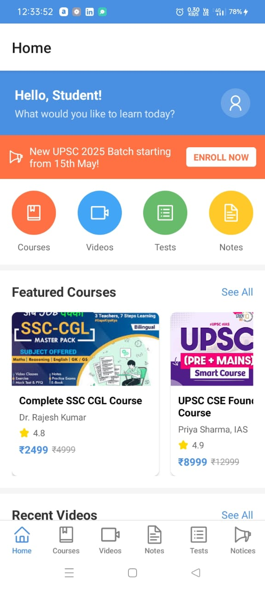
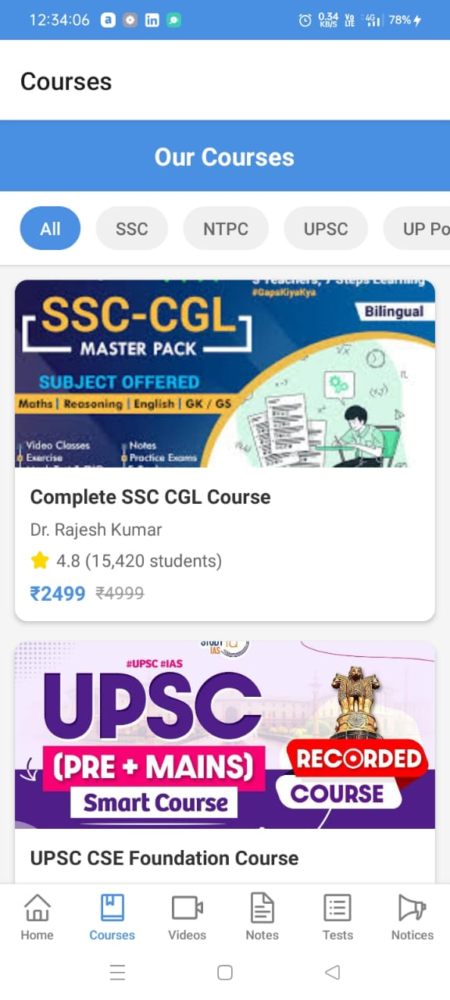
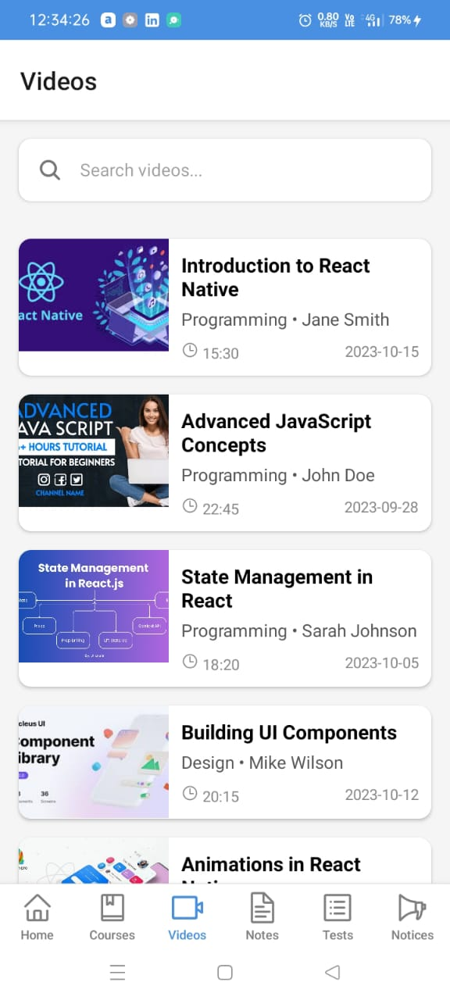
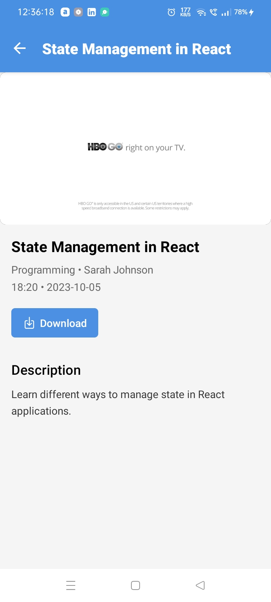
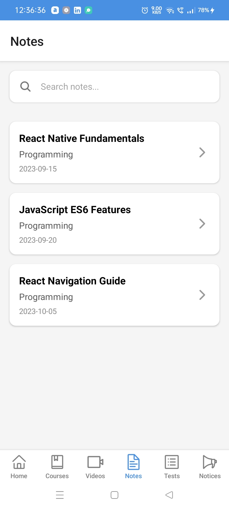
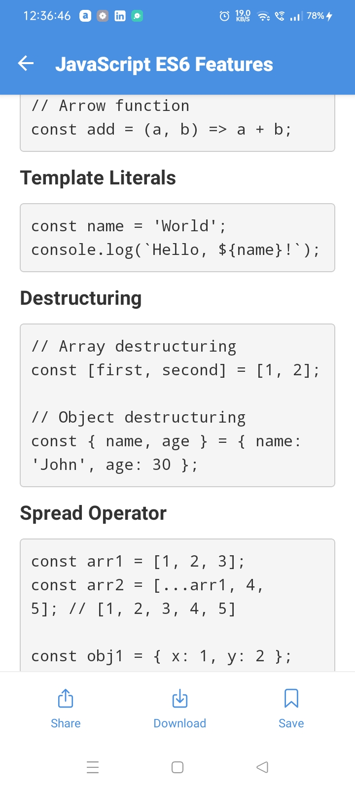
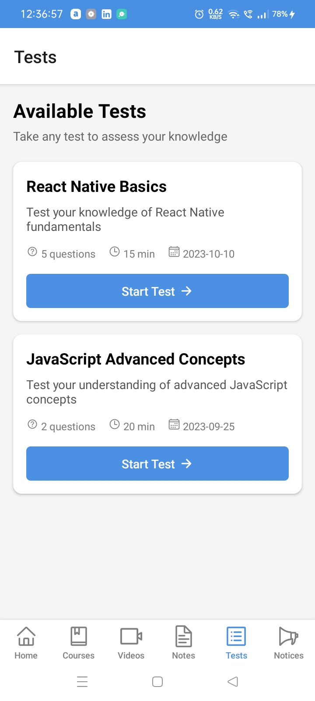
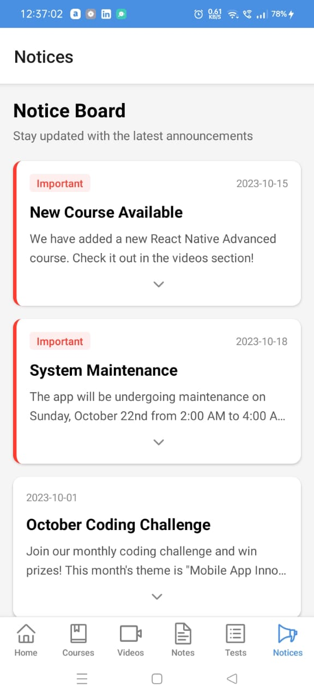

# 📘 Educational React Native App

This is a fully functional Educational Mobile App built using **React Native CLI**. The app is designed to help students access courses, watch video lectures, read notes, take tests, and stay updated via the notice board.

---

## 🚀 Features

- 🎓 Browse Courses and Details
- 🎥 Watch Educational Videos with Custom Player
- 📝 Read and Download Notes
- 🧪 Attempt Tests
- 📢 Get Important Updates from the Notice Board

---

## 📱 Screens Overview

### 🏠 1. Home Page
The home page displays a clean and user-friendly dashboard with quick access to all learning resources.

---

### 📚 2. Our Courses
Students can browse through all the available courses in a scrollable, grid-style layout.

---

### 📘 3. Course Detail Page
Each course displays its description, chapters, and access to videos, notes, and tests.

---

### 🎬 4. Video List
Displays a list of video lectures related to the course with titles, durations, and thumbnails.

---

### ▶️ 5. Video Player with Details & Download
Custom video player with play controls, course info, and a download option for offline viewing.

---

### 📄 6. Notes Section
Shows available notes (PDFs or text files) organized by topic and subject.

---

### 📑 7. Single Note View
Detailed view of a selected note with options to **Download**, **Save to Library**, or **Share**.

---

### 🧪 8. Available Tests
Interactive list of available quizzes and tests with attempt buttons.

---

### 📢 9. Notice Board
Official announcements and notifications are shown here to keep students updated.

---

## 🛠️ Tech Stack

- ⚛️ React Native CLI
- 🧠 Redux (optional for state)
- 📦 Axios / Fetch API
- 🎬 `react-native-video` for media playback
- 📂 `react-native-fs` or `rn-fetch-blob` for file downloads
- 💾 AsyncStorage for saving notes locally
- 📤 Share API for note sharing

---

## 📂 Folder Structure

